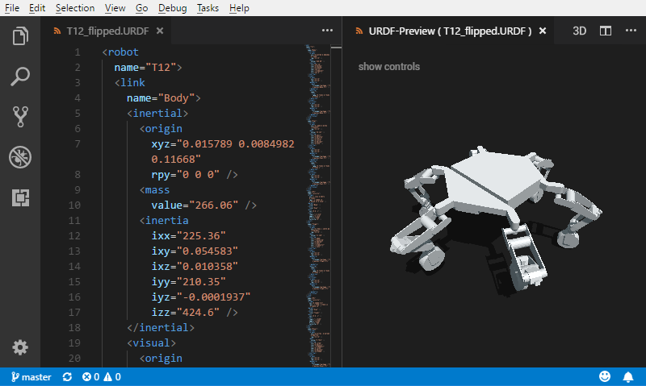

# URDF Preview VSCode Extension

VSCode extension for viewing and testing a URDF file. Based on the [URDFLoader](https://github.com/gkjohnson/urdf-loaders/) for THREE.js.

The 3D view reloads as the URDF file is edited and can only load geometry files and textures from within the current VSCode workspace.

_ATHLETE model and URDFLoader © 2018 California Institute of Technology, available [here](https://github.com/gkjohnson/urdf-loaders/)_

## TODO
- Create an icon for the extension
